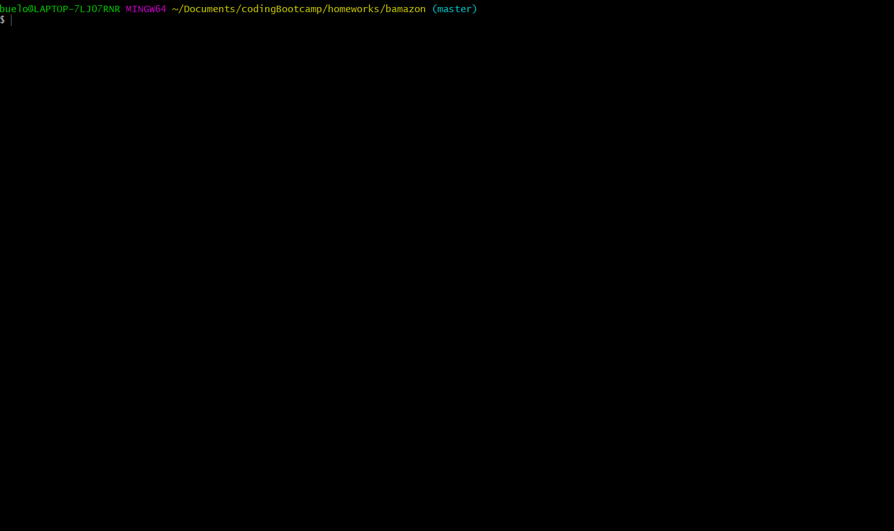
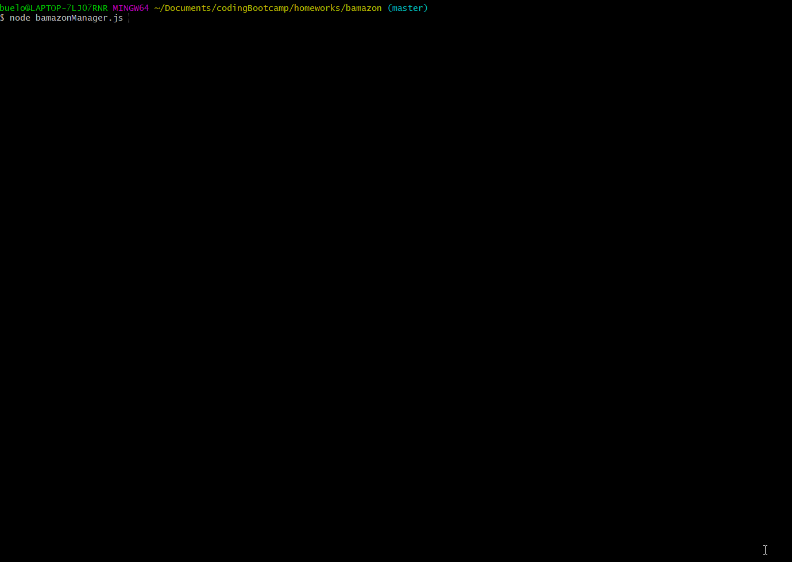
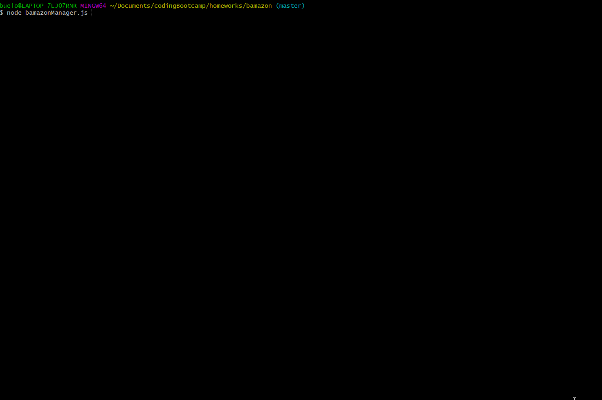

## CLI BAMAZON APP

**Project:** BAMAZON
**Goal of this Project:** Create a Amazon-Like storefront using MySQL. The app takes in orders from customers and deplete stock from the store's inventory (bamazonCustomer.js). There is also a second 'Manager' view to view product inventory, view products that need to be resupplied and to increase supplies as needed (bamazonManger.js). 

**Created by:** Ellen Buelow

**Directions:** Do you need to stock up on your favorite cookbooks? Look no further! Use this this app to find new books for your cooking inspiration. Below is a full list of the books we sell:

    Product List:
        - Simple - Yotam Ottolengi
        - Jerusalem - Yotam Ottolengi
        - Plenty - Yotam Ottolengi
        - Sweet - Yotam Ottolengi
        - Meyer's Baker - Clause Meyer
        - The Nordic Kitchen - Clause Meyer
        - Tacos Recipes and Provocations - Alex Stupak
        - Nopalito: A Mexican Kitchen - Gonzalo Guzman
        - Japanese Home Cooking - Morimoto
        - Japanese Farm Food - Kenji Miura
        - The Just Bento Cookbook: Everyday Lunches To Go -Makiko Itoh
        - Seven Fires: Gilling the Argentine Way - Francis Mallmann
        - The Fire Peru: Recipes and Stories From My Purvian Kitchen - Ricado Zarate
        - Gran Cocina Latina: The Food of Latin America - Maricel E. Presilla

**Proof of functionality:**
    **Examples of Customers Flow Path:**
        **Ex 1 Customer View: Ordering an item:**
            search: *node bamazonCustomer.js*
            Gif Example of Bamazon Customer ordering products in stock:
            
        **Example 2  Customer View: Ordering an item (items are out of stock):**
            search: *node bamazonCustomer.js*
            Gif Example of Bamazon Customer ordering products that are out of stock:
            
    **Examples of Manager Flow Path:**
        **Ex 1 Manager View: Products for sale:**
            search: *node bamazonManager.js*
            Gif Example of Bamazon Manager viewing products for sale:
            
        **Ex 2 Manager View: Low Inventory view**
            search: *node bamazonManager.js*
            Gif Example of Bamazon Manger checking which products have low inventory (<5):
            
        **Ex 3 Manager View: Add to Inventory**
            search: *node bamazonManger.js*
            Gif Example of Bamazon Manager adding additional inventory to stock:
            
            **Ex 3 Manager View: Add New Product**
            search: *node bamazonManager.js*
            Gif Example of Bamazon Manager adding new product to stock (product name, department, price, quantity):
            
       

